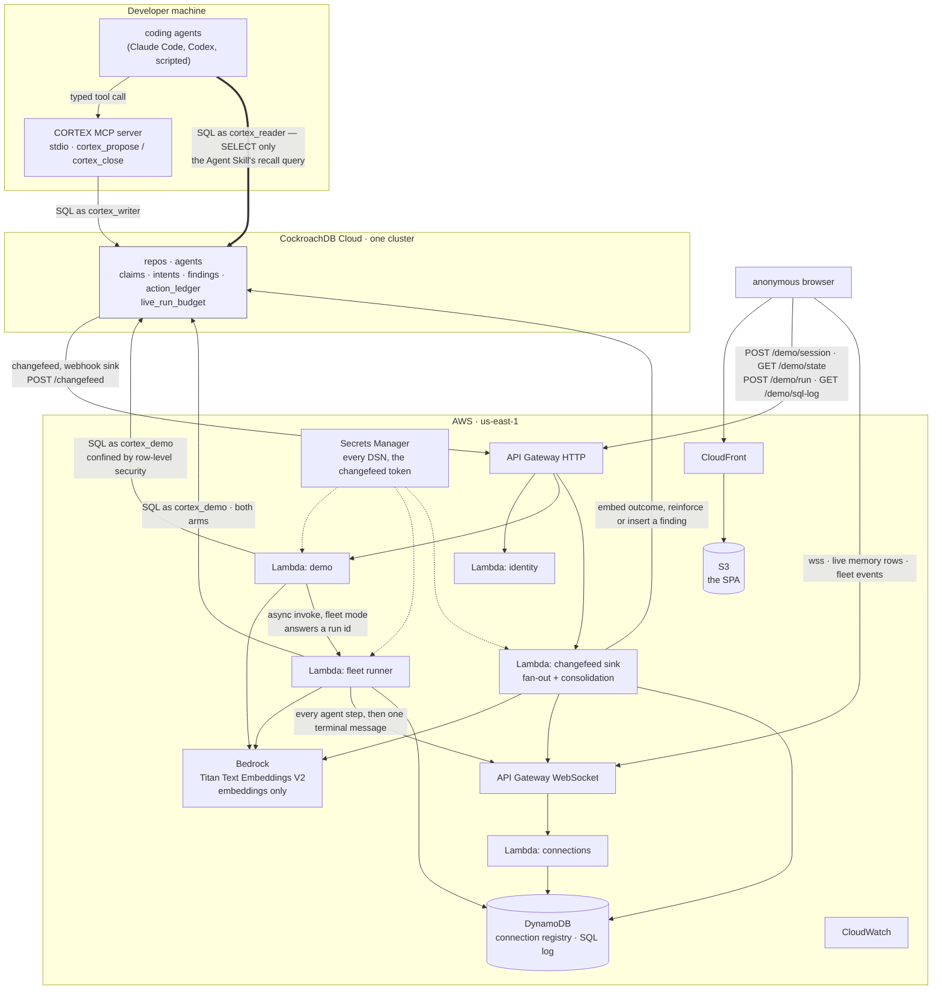

# Architecture

Public version of `spec/04-ARCHITECTURE.md`. Where this document and the spec disagree,
the deviation is recorded in `docs/SPEC-DELTA.md` and the reason in `docs/DECISIONS.md`
— this page describes **what is built and deployed**, not what was planned.

---

## 1. The picture



The thick edge is the point of the whole design: **agents read the cluster directly as
`cortex_reader`, a `SELECT`-only SQL principal, and reach every write through a typed
tool that arbitrates.** There is no path from an agent to a write verb.

Deployed surface, as of 2026-08-13: stack `CortexStack` from `infra/cdk/`, five Lambdas
behind an API Gateway HTTP API, a WebSocket API with two DynamoDB tables — the connection
registry and the show-SQL log — and S3 + CloudFront for the SPA. The fifth Lambda is the
fleet runner (U22): `POST /demo/run` in fleet mode invokes it asynchronously and answers a
run id in ~480ms, and the whole run — every agent step, ending in one terminal message —
arrives over the WebSocket. Lambda reaches CockroachDB Cloud with no VPC and no TLS work:
cold `queryMs` around 690, warm 3 on a reused pool.

**No deployed function can invoke a reasoning model, and the diagram says so deliberately.**
Every `bedrock:InvokeModel` grant in `infra/cdk/lib/cortex-stack.ts` is scoped to the Titan
embedding model by ARN — the demo Lambda, the fleet runner and the changefeed sink all embed
and none of them reason. Claude Sonnet 4.5 is invoked only from a developer machine, by
`npm run probe:reason` and by `npm run bench -- --record` when cassettes are recorded. LIVE
reasoning is designed (U24) and not built; nothing in the deployed system reaches it.

**Every DSN is a CloudFormation dynamic reference** (`{{resolve:secretsmanager:...}}`),
never a template value. The first arrangement wrote one into the synthesized template,
where it sat in `cdk.out/` and in CloudFormation's stored copy; that is why.

## 2. Privilege planes

Three principals, three connection strings, no overlap. One variable per plane, so no
deployment can promote one function's privileges into another's.

| Plane          | Principal       | Grants                                                                             | Route                                                        |
| -------------- | --------------- | ---------------------------------------------------------------------------------- | ------------------------------------------------------------ |
| **Read**       | `cortex_reader` | `SELECT` on the six memory tables, and no write verb anywhere                       | agents → `CORTEX_READER_DSN` → SQL                            |
| **Write**      | `cortex_writer` | `SELECT`, `INSERT`, `UPDATE`, `DELETE` on the six memory tables, and nothing else   | agents → CORTEX MCP tools → `CORTEX_WRITER_DSN` → SQL         |
| **Demo write** | `cortex_demo`   | the same DML, every statement confined by row-level security to one live demo scope | anonymous browser → API Gateway → demo Lambda → `CORTEX_DEMO_DSN` → SQL |

Three things worth stating precisely.

**The write plane needs `SELECT`.** A blocked claim returns the holder's identity and
prior outcome, which is a read, and `INSERT … RETURNING` requires the privilege anyway.
What makes the write plane safe is not the absence of `SELECT` but that it is reachable
only through a small, typed, parameterised surface. The security claim rests on
`cortex_reader` holding no write verb, and that direction is exactly enforced.

**A fourth credential exists and is deliberately an admin.** `CORTEX_DSN` applies
migrations (`scripts/sql.mts`) and manages changefeed jobs (`scripts/changefeed.mts`),
which genuinely need DDL and job control. Those two scripts are the only things that use
it. Keeping them on a separate variable is what lets the application's write plane be
least-privileged rather than nominally so — until 2026-08-13 one variable did both jobs
and `src/db/pool.ts` said `cortex_writer` while opening an admin connection. The fix is
held in place by `test/privilege-planes.test.ts`, which now asserts the write plane's
principal instead of assuming it.

**The read route is not the CockroachDB Cloud Managed MCP Server.** That server was the
design until it was invoked. It executes as SQL user `managed-mcp`, which holds `INSERT`
and `DELETE` on `claims` — confirmed by calling `insert_rows` and getting `23502`, a
constraint violation, rather than `42501`: the privilege check passed and only the row
was refused. It also publishes `insert_rows`, `create_table` and `create_database` as
tools. An agent given that endpoint for recall would have held an unarbitrated write path
into the two tables arbitration exists to protect, bypassing every invariant rather than
breaking one, because it would never have called `cortex_propose` at all. The route was
dropped and the read plane is a SQL grant that can be tested. `docs/verification-log.md`
V10 and V17.

### How the demo principal is confined

`cortex_demo` holds ordinary DML, and every one of the six memory tables carries `FORCE
ROW LEVEL SECURITY` with a policy admitting only rows whose repository is (a) a demo
scope that has not expired and (b) the scope named by this connection. `FORCE` and not
merely `ENABLE`, because `ENABLE` exempts the table owner and the policies would be
silently inert for it.

- **Real repository memory is unreachable, not filtered.** `demo_expires_at IS NOT NULL`
  is false for every real repository, so no value the write path supplies — including a
  real repository's own id, offered as though it were a session — makes one reachable.
- **Expiry is enforced at read time, not by a cleanup job.** A scope goes dark the
  instant `demo_expires_at` passes. A demo that must survive unattended should not have
  its security boundary depend on a job having run.
- **Session-versus-session isolation is defence at the write path, and says so.** Every
  visitor connects as the same SQL user, so there is no account boundary to put between
  two sessions. What the policy adds is that the scoping predicate **fails closed**: with
  no session set on the connection, `current_setting` returns NULL and the demo reads and
  writes nothing.

The scope is bound as a **parameter**, not interpolated: `SELECT set_config('cortex.demo_session', $1, true)`.
`SET` takes no bind parameter, and using it let a hostile session id reach the parser and
attempt `DROP TABLE claims`, stopped only by the grant. `is_local = true` also ends the
scope at `COMMIT`, so a pooled connection cannot carry one visitor's scope into the next
request.

Policy expressions on this cluster cannot contain a subquery, which is why the predicate
is a function (`is_current_demo_scope`). Every policy is `DROP`-then-`CREATE` rather than
`IF NOT EXISTS`, because the latter silently skips and an edited predicate would never
reach a live cluster.

## 3. Data flows

**A — an agent starts a task.** It issues the recall query as `cortex_reader`, receives
up to eight findings ordered by prior failure count, and incorporates them into its plan.
No write occurs and none is possible.

**B — an agent wants to act.** It calls `cortex_propose`. The intent is embedded via
Bedrock Titan, and then **one transaction** runs the similarity search and the claim
insert on one snapshot, returning `granted`, `deduped`, or `blocked` with the holder's
identity and prior outcome. The whole thesis lives in that transaction: if the similarity
check and the claim insert ever land in different transactions, connections or requests,
the project is falsified by its own code. `test/propose.test.ts` holds it.

**C — an agent finishes.** It calls `cortex_close`. Outcome, ledger entry and claim
release commit in one transaction, keyed idempotently so a retried close applies once.

**D — consolidation.** The changefeed on `intents` emits a row reaching `done` **or
`abandoned`**; the webhook sink posts to API Gateway; the changefeed Lambda embeds the
outcome and either reinforces the nearest finding in that repository or inserts a new one.

Abandonment is memory on purpose. An abandoned intent is a concluded outcome, and the
fleet's most expensive knowledge is what it gave up on. Two details that were measured
rather than reasoned: the candidate search carries `WHERE repo_id`, without which a fresh
consolidation reinforces an existing finding in the cluster instead of inserting; and for
abandonment **what is embedded is not what is stored** — the abandon reason names the
obstacle and sits outside recall's distance threshold from the task it exists to warn,
while the bare statement names the work and is retrieved. `npm run gate:consolidate`
proves the path end to end, 8/8, including the abandoned half.

**E — the live view.** The same changefeed events fan out over the WebSocket to the demo
UI, so the memory panel updates from the database's own change stream rather than from
application-side echoes. The UI shows what committed, not what the app believes it sent.
A finding inserted by flow D is itself a row change, so it comes back over the same socket
a moment later: the judge watches memory improve over the stream that showed the work.

### Where this departs from the spec

`spec/04-ARCHITECTURE.md` §2 routes flow D through EventBridge. **The deployment does
not** — the changefeed Lambda does both the fan-out and the consolidation. The bus would
buy asynchrony the handler already has (the sink answers 200 regardless, and a
consolidation failure is caught and logged rather than retried) at the price of a second
hop and a second failure mode. What it would buy that matters is a separate concurrency
pool for the two consumers, and on this account reserved concurrency cannot be set at all
(see §5). Recorded in `docs/SPEC-DELTA.md`.

## 4. Deployment

| Surface                | Service                        | Note                                     |
| ---------------------- | ------------------------------ | ---------------------------------------- |
| demo front end         | S3 + CloudFront                | static SPA, no server rendering          |
| demo API               | API Gateway HTTP + Lambda      | four routes, no arbitrary SQL exposed    |
| live memory stream     | API Gateway WebSocket + Lambda | pushed, not polled; DynamoDB connection registry |
| changefeed ingress     | API Gateway HTTP               | webhook sink target                      |
| consolidation          | the same changefeed Lambda     | asynchronous, off the agent's critical path |
| embeddings             | Bedrock                        | Titan, on every deployed function; **no deployed function can invoke a reasoning model** |
| secrets                | Secrets Manager                | every DSN and the changefeed token, by dynamic reference |
| guardrails             | CloudWatch                     | see §5; the AWS Budget alarm is **not built** |

Artifacts are **not** in S3. `bench/cassettes/`, `bench/fixtures/` and `bench/results/` are
committed to git — that is what makes the benchmark reproducible from a clean clone with
nothing provisioned. The bucket holds the SPA and nothing else.

No long-lived compute anywhere. Infrastructure as code is a single **CDK** app in
`infra/cdk/`; both CDK and SAM were built and timed and the ten-minute redeploy criterion
did not separate them (42s vs 33s), so the choice was made on what the source looks like.

`node infra/bundle.mjs` must be run before every deploy — nothing does it automatically —
and `npm run deploy:secrets` must have run once, or CloudFormation fails on an
unresolvable secret reference.

## 5. Guardrails and the degradation ladder

The hosted demo must stay free, anonymous and reachable through judging. That makes every
cost brake also a way to take the demo off the air, so each is scoped to the LIVE
reasoning path and nothing else.

| Brake                                  | Status                                                                        |
| -------------------------------------- | ----------------------------------------------------------------------------- |
| reserved concurrency on the LIVE Lambda | **falsified and unimplemented.** This account's Lambda concurrency limit is 10, below AWS's default of 1000, and AWS refuses any reservation that would drop unreserved concurrency below 10. Every value from 1 up is rejected. The quota increase cannot be requested from the CLI, and the Support API needs a paid plan. **Build for 10.** |
| a global run counter in the database    | built, on a seventh table (`live_run_budget`). It carries no `repo_id` because the counter is global, and that exemption is asserted against `information_schema` so it cannot widen. `cortex_demo` reaches today's row and no other day, and holds no `DELETE` — a principal that can delete today's row can reset the brake that governs it. |
| an AWS Budget alarm                     | **not built.** When it is, it must filter on the service name **`Claude Sonnet 4.5 (Amazon Bedrock Edition)`**, which Cost Explorer bills separately from `Amazon Bedrock`. A budget watching only `Amazon Bedrock` sees a meter carrying the Titan line alone and never fires. |

The daily LIVE cap is **10 runs**, not the spec's 40, because the Bedrock rate is
measured from this account's own billing at **$3.30 per 1M input tokens and $16.50 per 1M
output**. At the spec's own default the spec's own "single-digit dollars" target is
missed. Deviation recorded in `docs/SPEC-DELTA.md`.

Four limits are reachable, and **every one of them must resolve to a working page rather
than to a failure.** No rung may present an error page, a credential field, a login or a
payment gate, and no rung may misrepresent liveness.

**One of the four is built: rung 2.** Rung 1 has nothing to exhaust until LIVE reasoning
exists; rung 3's mechanism is a per-visitor row cap that the two-scope design turns into
two budgets, and building it against one scope would be building it twice; rung 4 is not
built. The table below is the ladder as designed, with the status of each rung named.

| Rung | Status | Limit reached                        | Behaviour                                                                            | What is still true                          |
| ---- | ------ | ------------------------------------ | ------------------------------------------------------------------------------------ | ------------------------------------------- |
| 1    | not built | LIVE reasoning quota exhausted    | switch to REPLAY and state the reason on screen                                       | database behaviour fully live               |
| 2    | **built and forced** | Bedrock embeddings throttled | deterministic local hash vector, intent marked `embedding_degraded`, dedupe **skipped** | database behaviour fully live, dedupe degraded and labelled |
| 3    | not built | per-session row cap reached       | session becomes read-only; rows, counters and SQL log stay inspectable                | everything on screen is still real          |
| 4    | not built | cluster or write path unavailable | pre-recorded walkthrough from S3 and CloudFront behind an explicit banner              | nothing is live, and the banner says so     |

Rung 2 is built and **forced** rather than reasoned about: `npm run gate:degrade`, 7/7.
Dedupe is skipped rather than run at a threshold of zero, because the show-SQL panel would
otherwise display a search that did not happen. `findDuplicate` also carries `AND NOT
embedding_degraded` — a hash vector left in the candidate set corrupts every later dedupe
decision, long after Bedrock recovers. Rung 2 was forced first because it is reachable in
REPLAY as well as LIVE: REPLAY caches reasoning, not embeddings.

## 6. The demo surface

Four HTTP routes plus the WebSocket stream, all anonymous, all decided in
`src/demo/api.ts` — a plain function with no AWS types in it, so `test/demo-plane.test.ts`
can drive the whole route surface against the real cluster without deploying.

```
POST /demo/session     GET /demo/state     POST /demo/run     GET /demo/sql-log
```

**No credential field exists on any of them, under any name, commented out or
feature-flagged off.** The surface refuses a credential-shaped value in the body *and* in
the query string, with a 400 naming the offending field, because a silently dropped
credential looks exactly like an accepted one. The path is deliberately not scanned: a
path names a route, not a field, and the router 404s anything it does not know.

The show-SQL panel is a **transcript, not a description**. `src/db/recorder.ts` wraps the
live client, so a statement reaches the panel only by having gone to the driver. The log
is grouped by transaction — concurrent agents interleave two `BEGIN`s, and a flat list
stops showing the one-transaction invariant at all.

## 7. Observability

- Structured JSON logs to CloudWatch from every Lambda, correlated by `intent_id`.
- The demo UI displays claim p50 and the retry counter live, and every number on it is
  computed from the database rather than asserted — `test/scenario.test.ts` fails if a
  meter figure is set from a numeric literal or incremented without a condition.
- Duplicate work is measured for **both** arms by one rule: the dedupe threshold applied
  after the fact, with distances computed by the cluster's own `<=>` operator.
